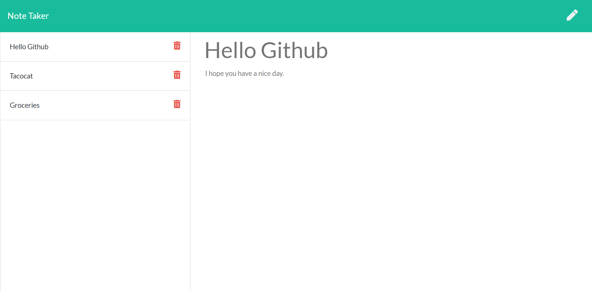

# Note-Taker
Updated Portfolio Page assignment for University of Toronto coding bootcamp.

Live Demo: https://express-note-taker.herokuapp.com/

This assignment focused on taking a prebuilt front end application and creating a backend to handle get, post and delete calls using express to a json file.

